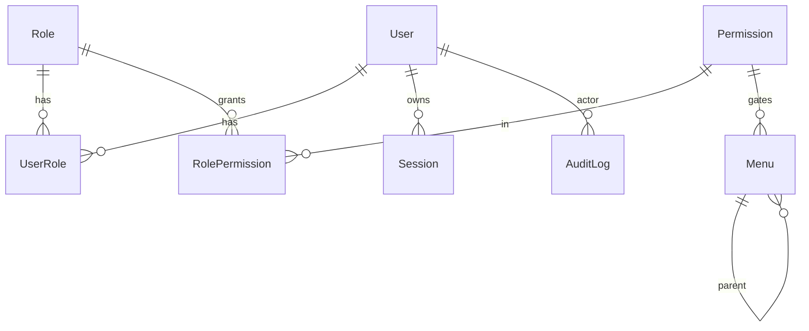

# DATABASE

> Status: **draft skeleton.** Only the platform tables below are confirmed in scope for
> session 1. Domain entities (customers, products, invoices, …) are added after discovery,
> and only when the reference app actually supports them.

## Conventions

- `id` — cuid/uuid primary key.
- Every business table: `createdAt`, `updatedAt`, `createdById`, `updatedById`, `deletedAt` (nullable, soft delete).
- Money stored as integer minor units (paisa) or `Decimal(18,2)` — **decided in schema**, never `float`.
- FKs indexed. Natural unique keys enforced at DB level.
- Multi-tenant scoping column (`organizationId` / `branchId`) added if discovery shows it.

## Platform tables (session 1)

### `User`
| field | type | notes |
|-------|------|-------|
| id | pk | |
| email | string | unique, citext |
| name | string | |
| passwordHash | string | argon2id |
| status | enum(ACTIVE, DISABLED) | |
| lastLoginAt | datetime? | |
| + audit/soft-delete columns | | |

### `Role`
`id, key (unique), name, description, isSystem (bool)`

### `Permission`
`id, key (unique, "<module>.<action>"), module, action, description`

### `UserRole`  (join)
`userId → User`, `roleId → Role`, unique(`userId`,`roleId`)

### `RolePermission`  (join)
`roleId → Role`, `permissionId → Permission`, unique(`roleId`,`permissionId`)

### `Session`
`id, userId → User, tokenHash (unique), createdAt, expiresAt, lastSeenAt, ip, userAgent, revokedAt?`

### `Menu`
`id, parentId → Menu?, title, slug (unique), route, icon, order, isActive, permissionKey?, moduleId?, isExternal`

### `AuditLog`
`id, userId → User?, action, entity, entityId?, meta (json), ip, createdAt`

### `LoginAttempt`  (rate limiting / lockout)
`id, email, ip, success (bool), createdAt`

## ER diagram (platform)

## Domain entities (post-discovery — placeholder)

Candidate list from the brief, **to confirm against the reference app**:
Organization, Branch, Customer, Supplier, Product, Category, Unit, Tax, PriceList,
Invoice, InvoiceItem, Payment, Transaction / JournalEntry, ChartOfAccount,
InventoryItem, StockMovement, FixedAsset, DepreciationEntry, Report definitions, Settings.

Do **not** create these until observed. Record each in this file with full column list,
FKs, unique constraints, indexes, and relationships when added.
