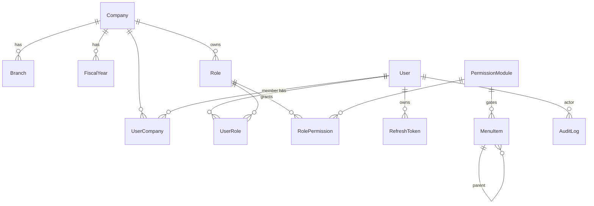

# DATABASE

PostgreSQL + Prisma. Schema file: `app/prisma/schema.prisma`.
Migrations: `app/prisma/migrations/`. Seed: `app/prisma/seed.ts`.

## Conventions
- `id`: cuid PK.
- Business tables: `createdAt`, `updatedAt`, `deletedAt?` (soft delete), and (where relevant)
  `createdById` / `updatedById`.
- Money: `Decimal(18,2)`; quantities `Decimal(18,3)`. **Never float.**
- FKs indexed. Natural unique keys enforced at DB level.
- Tenant scoping: `companyId` (and often `branchId` / `fiscalYearId`) on domain tables.

---

## Platform tables (migration `init_platform`, applied) — 14 models

### Tenancy
| Model | Key fields | Notes |
|-------|-----------|-------|
| `Company` | `name`, `subdomain` (unique), `address`, `allowsBranchCreation` | multi-tenant root |
| `Branch` | `companyId→Company`, `name`, `address`, `isActive` | unique(companyId,name) |
| `FiscalYear` | `companyId`, `name` "2083-84", `startDate`, `endDate`, `active` | unique(companyId,name) |

### Identity
| Model | Key fields | Notes |
|-------|-----------|-------|
| `User` | `firstName`, `lastName`, `email` (unique), `phone`, `passwordHash`, `userType`, `status` (ACTIVE/DISABLED/INVITED), `lastLoginAt` | `userType="ADMIN"` ⇒ permission wildcard |
| `UserCompany` | `userId`, `companyId`, `isDefault` | unique(userId,companyId) |

### Roles & permissions  (reproduces Settings › User & Permissions matrix)
| Model | Key fields | Notes |
|-------|-----------|-------|
| `Role` | `companyId`, `name` (free text: Admin/Cashier/…), `isSystem` | unique(companyId,name); per-company |
| `PermissionModule` | `groupKey`, `groupName`, `key` (unique, `"<group>.<module>"`), `label`, `order` | the 76 UI modules |
| `RolePermission` | `roleId`, `moduleId`, `canCreate/canRead/canUpdate/canDelete` | unique(roleId,moduleId) |
| `UserRole` | `userId`, `roleId` | unique(userId,roleId) |

### Auth
| Model | Key fields | Notes |
|-------|-----------|-------|
| `RefreshToken` | `userId`, `tokenHash` (unique, sha256), `expiresAt`, `revokedAt?`, `ip`, `userAgent` | rotating; id = JWT `jti` |
| `LoginAttempt` | `email`, `ip`, `success`, `createdAt` | brute-force throttle |

### Navigation (data-driven)
| Model | Key fields | Notes |
|-------|-----------|-------|
| `MenuItem` | `parentId?→MenuItem`, `title`, `slug` (unique), `route?`, `icon?`, `order`, `isActive`, `isExternal`, `permissionKey?` | `permissionKey` → `PermissionModule.key`; null ⇒ always visible |

### Cross-cutting
| Model | Key fields | Notes |
|-------|-----------|-------|
| `AuditLog` | `userId?`, `companyId?`, `action`, `entity?`, `entityId?`, `meta` (json), `ip`, `createdAt` | LOGIN/LOGOUT/CREATE/UPDATE/DELETE/… |
| `Reminder` | `userId`, `companyId`, `title`, `description?`, `remindAt`, `status` | dashboard widget |
| `Notification` | `userId`, `companyId`, `title`, `body?`, `readAt?` | header bell |

---

## Reference backend model inventory (authoritative — 76 Django models)

Extracted from `GET /users/group/` (`content_type` values) + endpoint inspection —
see `Docs/REFERENCE-API-MAP.md`. This is the **source of truth for the domain model**.
Our clone models each with full columns/FKs/indexes as its module is built; names are ours.

### Accounting core (double-entry GL) — ✅ BUILT (session 5)
| Reference model | Clone model | Notes |
|---|---|---|
| `account head` | **`AccountHead`** ✅ | NFRS L1. `code, name, accountType(AccountType), currentType(CurrentType), financialType(FinancialType), isSystem, isActive`. Seeded: 36 heads. |
| `group head` | **`AccountGroup`** ✅ | NFRS L2. `code (HEAD-NN), name, accountHeadId, isSystem`. Seeded: 106 groups. |
| `general ledger` | **`Ledger`** ✅ | L3 posting account. `code (HEAD-NN-NNNN), name, accountGroupId, openingBalance(Decimal), openingType(DR/CR), isSystem, isActive` + party fields (`contactKind, panNumber, phone, email, address, creditLimit, iecNo, gstin, bankName, bankAccount`) when it is a customer/supplier. Seeded: 181 NFRS ledgers + `Opening Balance Adjustment` suspense. |
| `voucher` / `slip` | **`Voucher` + `VoucherLine`** ✅ | `number, date, type(VoucherType: OPENING/JOURNAL/CONTRA/STOCK/SALES/PURCHASE/RECEIPT/PAYMENT/CREDIT_NOTE/DEBIT_NOTE/EXPENSE), fiscalYearId, narration, sourceType, sourceId, createdById`. Lines: `ledgerId, debit, credit, narration, order`. **All GL writes go through `postVoucher()` — Σdebit = Σcredit enforced.** Opening balances post an OPENING voucher vs the suspense account. |
| — | **`NumberSequence`** ✅ | gap-free per `(companyId, fiscalYearId, key)` — used for voucher numbers, will serve invoices too |
| `bank information` | `Bank` (planned) | master list of Nepali banks |
| `bank detail` | `CompanyBankAccount` (planned) | company's own bank accounts (for bill print) |

Trial Balance / Ledger Statement compute **purely from `VoucherLine`** aggregation
(`src/server/accounts/gl.ts`), never from source documents.

### Inventory
| Reference | Clone | Notes |
|---|---|---|
| `category` | `ProductCategory` | self-ref `subCategory`, image, active |
| `unit` | `Unit` | `name, shortName, acceptFraction, active` |
| `product` | `Product` | `kind (GD/SR/EX), name, categoryId, hsnCode, sku, reorderPoint, unitId, subUnitId, unitConversion, tertiaryUnitId, tertiaryConversion, purchasePrice, sellingPrice, taxType(INCLUSIVE/EXCLUSIVE), nonTaxable, size, color, flavour, dftqcNo, madeImportedFrom, expiryDate` |
| `product additional field` | `ProductAdditionalField` | serialised-item fields (Barcode, Engine/Chassis/Battery/Serial/IMEI No, Color, Reg No, MFG Year) — toggleable |
| `batch` | `ProductBatch` | per-warehouse batch; line-item picker source |
| `ware house` | `Warehouse` | `name, branchId` |
| `ware house transfer` | `WarehouseTransfer` | inter-warehouse |
| `branch inventory transfer` | `BranchInventoryTransfer` | inter-branch |
| `inventory adjustment` | `InventoryAdjustment` | +/- with reason |
| `material bill` | `MaterialBill` (BOM) | manufacturing bill of materials |
| `manufacture demolish` | `ManufactureEntry` | production (assemble/disassemble) |
| — (derived) | `StockMovement` | ledger of every qty change (opening/purchase/sale/adjust/transfer/return/manufacture); **current stock = Σ movements** |

### Sales
`invoice` (`invoice_type=SA`) + `InvoiceItem` · `quotation` (QU) · `perfoma invoice` (PF) ·
`sales order` (SO) · `chalani` (delivery note) · `cheque` · `printing cost register` ·
`paper roll register` · Receipt (customer payment) · Credit Note (sales return).

### Purchase
`purchase order` (PO) · `invoice` (`invoice_type=PU`) + items (excise/custom duty) ·
`goods received` (GRN) · `import invoice` (with LC/customs) · `expense` · Debit Note
(purchase return) · Supplier Payment.

### Fixed Assets  ⚠️ present in backend, minimal in nav
`asset` · `asset life` (depreciation schedule) · `asset expense` · `capitalization` ·
`purchase asset` · `purchase order asset` · `sell asset` · `lost stole broken` ·
`ownership letter`.

### CRM
`crm client` · `crm partner` · `crm contract` · `crm follow up` · `crm interaction` ·
`crm target` · `visit history` · `location point` (field-sales GPS).

### Budget (NGO / project-fund oriented)
`budget heading` (parent, source Manual|COA-GL, restricted flag) · `budget` · `budget allocation`
· `budget fund` (donor) · `project`.

### Industry verticals  ⚠️ backend supports; likely feature-flagged
`workshop job card` · `workshop technician` (auto/repair) · `restaurant table` · `token entry`
(fuel dealer) · `paper roll register` / `printing cost register` (press/printing).

### Store Builder (e-commerce storefront)
`store theme config` · `store slider` · `store offer ad` · `store review` · (store orders).

### Platform / config
`company information` · `fiscal year` · `bill footer` · `custom field` · `custom status` ·
`additional field` · `tax information` · `document` · `integration api key` · `site` ·
`profile` · `notification` · `reminder` · `User` · `group` · `permission`.

### Enums (from API)
- Account `account_type`: `AS/LI/EQ/IN/EX`; `current_account_type`: `CU/NC/O`;
  `financial_account_type`: `FI/NF/O`; `balance_type`: `DR/CR`.
- `invoice_type`: `SA` sales · `PU` purchase · `QU` quotation · `SO` sales order ·
  `PO` purchase order · `PF` proforma.
- `slip_type`: `JO` journal · `CO` contra · `ST` stock journal.
- `product_type`: `GD` goods · `SR` service · `EX` expense.
- product `taxType`: tax-inclusive / tax-exclusive (+ `nonTaxable` flag).

Rule: only add an entity once its behaviour is observed in the reference app.
