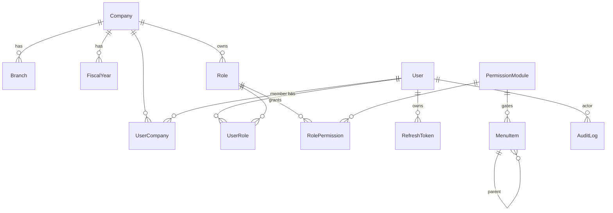

# DATABASE

PostgreSQL + Prisma. Schema file: `app/prisma/schema.prisma`.
Migrations: `app/prisma/migrations/`. Seed: `app/prisma/seed.ts`.

## Conventions
- `id`: cuid PK.
- Business tables: `createdAt`, `updatedAt`, `deletedAt?` (soft delete), and (where relevant)
  `createdById` / `updatedById`.
- Money: `Decimal(18,2)`; quantities `Decimal(18,3)`. **Never float.**
- FKs indexed. Natural unique keys enforced at DB level.
- Tenant scoping: `companyId` (and often `branchId` / `fiscalYearId`) on domain tables.

---

## Platform tables (migration `init_platform`, applied) — 14 models

### Tenancy
| Model | Key fields | Notes |
|-------|-----------|-------|
| `Company` | `name`, `subdomain` (unique), `address`, `allowsBranchCreation` | multi-tenant root |
| `Branch` | `companyId→Company`, `name`, `address`, `isActive` | unique(companyId,name) |
| `FiscalYear` | `companyId`, `name` "2083-84", `startDate`, `endDate`, `active` | unique(companyId,name) |

### Identity
| Model | Key fields | Notes |
|-------|-----------|-------|
| `User` | `firstName`, `lastName`, `email` (unique), `phone`, `passwordHash`, `userType`, `status` (ACTIVE/DISABLED/INVITED), `lastLoginAt` | `userType="ADMIN"` ⇒ permission wildcard |
| `UserCompany` | `userId`, `companyId`, `isDefault` | unique(userId,companyId) |

### Roles & permissions  (reproduces Settings › User & Permissions matrix)
| Model | Key fields | Notes |
|-------|-----------|-------|
| `Role` | `companyId`, `name` (free text: Admin/Cashier/…), `isSystem` | unique(companyId,name); per-company |
| `PermissionModule` | `groupKey`, `groupName`, `key` (unique, `"<group>.<module>"`), `label`, `order` | the 76 UI modules |
| `RolePermission` | `roleId`, `moduleId`, `canCreate/canRead/canUpdate/canDelete` | unique(roleId,moduleId) |
| `UserRole` | `userId`, `roleId` | unique(userId,roleId) |

### Auth
| Model | Key fields | Notes |
|-------|-----------|-------|
| `RefreshToken` | `userId`, `tokenHash` (unique, sha256), `expiresAt`, `revokedAt?`, `ip`, `userAgent` | rotating; id = JWT `jti` |
| `LoginAttempt` | `email`, `ip`, `success`, `createdAt` | brute-force throttle |

### Navigation (data-driven)
| Model | Key fields | Notes |
|-------|-----------|-------|
| `MenuItem` | `parentId?→MenuItem`, `title`, `slug` (unique), `route?`, `icon?`, `order`, `isActive`, `isExternal`, `permissionKey?` | `permissionKey` → `PermissionModule.key`; null ⇒ always visible |

### Cross-cutting
| Model | Key fields | Notes |
|-------|-----------|-------|
| `AuditLog` | `userId?`, `companyId?`, `action`, `entity?`, `entityId?`, `meta` (json), `ip`, `createdAt` | LOGIN/LOGOUT/CREATE/UPDATE/DELETE/… |
| `Reminder` | `userId`, `companyId`, `title`, `description?`, `remindAt`, `status` | dashboard widget |
| `Notification` | `userId`, `companyId`, `title`, `body?`, `readAt?` | header bell |

---

## Domain entities — NOT YET MODELLED (added per module, Phase 5)

Confirmed to exist in the reference (see `INVENTORY.md` / `DISCOVERY-LOG.md`); model each
with full columns, FKs, unique constraints, indexes when its module is built:

- **Accounts:** `ChartOfAccount` (code, name, groupingHead, financialHeading, financial?,
  current?, accountType Assets/Liability/Equity/Income/Expense, openingBalance, dr/cr),
  `AccountGroupingHead`, `Contact` (customer/supplier, PAN, address, opening balance),
  `CashBankAccount`, `Bank`, `PaymentQr`.
- **Inventory:** `ProductCategory`, `Unit` (+ sub/tertiary conversions), `Warehouse`,
  `Product` (kind Goods/Service/Expense, HSN, SKU, reorder pt, taxType, prices, attributes:
  size/color/flavour/DFTQC/expiry), `Batch`, `StockMovement` (opening/purchase/sale/
  adjustment/transfer/return), `WarehouseTransfer`, `InventoryAdjustment`.
- **Sales:** `Quotation`, `ProformaInvoice`, `SalesOrder`, `SalesInvoice` + `SalesInvoiceItem`,
  `Receipt`, `CreditNote`, `Chalani`, `Cheque`, `PrintingCostRegister`.
- **Purchase:** `PurchaseOrder`, `PurchaseInvoice` + `PurchaseInvoiceItem` (excise/custom duty),
  `Expense`, `DebitNote`, `SupplierPayment`, `GoodsReceived`, `Import`.
- **Vouchers / GL:** `Voucher` (journal/contra/stock), `VoucherLine` (accountId, debit, credit,
  narration), `LedgerEntry` / `GeneralLedger`.
- **Budget:** `BudgetHeading` (parent, source Manual|COA, restricted?), `Budget`, `Allocation`,
  `Fund`.
- **Token:** `FuelToken` + `FuelTokenItem`.
- **CRM:** `CrmClient`, `CrmPartner`, `FollowUp`, `CallLog`.
- **Documents:** `DocumentFolder`, `DocumentFile`.
- **Store Builder:** `StoreTheme`, `HeroSlider`, `OfferAd`, `Review`, `StoreOrder`.
- **Settings:** `TaxRate`, `CustomField`, `CustomStatus`, `PrintingTemplate`, `BillFooter`,
  `CompanyInfo`, `InvoiceSetting`, `BackupJob`.

Rule: only add an entity once its behaviour is observed in the reference app.
