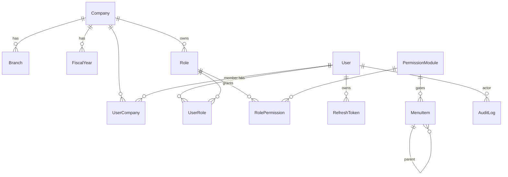

# DATABASE

PostgreSQL + Prisma. Schema file: `app/prisma/schema.prisma`.
Migrations: `app/prisma/migrations/`. Seed: `app/prisma/seed.ts`.

## Conventions
- `id`: cuid PK.
- Business tables: `createdAt`, `updatedAt`, `deletedAt?` (soft delete), and (where relevant)
  `createdById` / `updatedById`.
- Money: `Decimal(18,2)`; quantities `Decimal(18,3)`. **Never float.**
- FKs indexed. Natural unique keys enforced at DB level.
- Tenant scoping: `companyId` (and often `branchId` / `fiscalYearId`) on domain tables.

---

## Platform tables (migration `init_platform`, applied) — 14 models

### Tenancy
| Model | Key fields | Notes |
|-------|-----------|-------|
| `Company` | `name`, `subdomain` (unique), `address`, `allowsBranchCreation` | multi-tenant root |
| `Branch` | `companyId→Company`, `name`, `address`, `isActive` | unique(companyId,name) |
| `FiscalYear` | `companyId`, `name` "2083-84", `startDate`, `endDate`, `active` | unique(companyId,name) |

### Identity
| Model | Key fields | Notes |
|-------|-----------|-------|
| `User` | `firstName`, `lastName`, `email` (unique), `phone`, `passwordHash`, `userType`, `status` (ACTIVE/DISABLED/INVITED), `lastLoginAt` | `userType="ADMIN"` ⇒ permission wildcard |
| `UserCompany` | `userId`, `companyId`, `isDefault` | unique(userId,companyId) |

### Roles & permissions  (reproduces Settings › User & Permissions matrix)
| Model | Key fields | Notes |
|-------|-----------|-------|
| `Role` | `companyId`, `name` (free text: Admin/Cashier/…), `isSystem` | unique(companyId,name); per-company |
| `PermissionModule` | `groupKey`, `groupName`, `key` (unique, `"<group>.<module>"`), `label`, `order` | the 76 UI modules |
| `RolePermission` | `roleId`, `moduleId`, `canCreate/canRead/canUpdate/canDelete` | unique(roleId,moduleId) |
| `UserRole` | `userId`, `roleId` | unique(userId,roleId) |

### Auth
| Model | Key fields | Notes |
|-------|-----------|-------|
| `RefreshToken` | `userId`, `tokenHash` (unique, sha256), `expiresAt`, `revokedAt?`, `ip`, `userAgent` | rotating; id = JWT `jti` |
| `LoginAttempt` | `email`, `ip`, `success`, `createdAt` | brute-force throttle |

### Navigation (data-driven)
| Model | Key fields | Notes |
|-------|-----------|-------|
| `MenuItem` | `parentId?→MenuItem`, `title`, `slug` (unique), `route?`, `icon?`, `order`, `isActive`, `isExternal`, `permissionKey?` | `permissionKey` → `PermissionModule.key`; null ⇒ always visible |

### Cross-cutting
| Model | Key fields | Notes |
|-------|-----------|-------|
| `AuditLog` | `userId?`, `companyId?`, `action`, `entity?`, `entityId?`, `meta` (json), `ip`, `createdAt` | LOGIN/LOGOUT/CREATE/UPDATE/DELETE/… |
| `Reminder` | `userId`, `companyId`, `title`, `description?`, `remindAt`, `status` | dashboard widget |
| `Notification` | `userId`, `companyId`, `title`, `body?`, `readAt?` | header bell |

---

## Reference backend model inventory (authoritative — 76 Django models)

Extracted from `GET /users/group/` (`content_type` values) + endpoint inspection —
see `Docs/REFERENCE-API-MAP.md`. This is the **source of truth for the domain model**.
Our clone models each with full columns/FKs/indexes as its module is built; names are ours.

### Accounting core (double-entry GL) — ✅ BUILT (session 5)
| Reference model | Clone model | Notes |
|---|---|---|
| `account head` | **`AccountHead`** ✅ | NFRS L1. `code, name, accountType(AccountType), currentType(CurrentType), financialType(FinancialType), isSystem, isActive`. Seeded: 36 heads. |
| `group head` | **`AccountGroup`** ✅ | NFRS L2. `code (HEAD-NN), name, accountHeadId, isSystem`. Seeded: 106 groups. |
| `general ledger` | **`Ledger`** ✅ | L3 posting account. `code (HEAD-NN-NNNN), name, accountGroupId, openingBalance(Decimal), openingType(DR/CR), isSystem, isActive` + party fields (`contactKind, panNumber, phone, email, address, creditLimit, iecNo, gstin, bankName, bankAccount`) when it is a customer/supplier. Seeded: 181 NFRS ledgers + `Opening Balance Adjustment` suspense. |
| `voucher` / `slip` | **`Voucher` + `VoucherLine`** ✅ | `number, date, type(VoucherType: OPENING/JOURNAL/CONTRA/STOCK/SALES/PURCHASE/RECEIPT/PAYMENT/CREDIT_NOTE/DEBIT_NOTE/EXPENSE), fiscalYearId, narration, sourceType, sourceId, createdById`. Lines: `ledgerId, debit, credit, narration, order`. **All GL writes go through `postVoucher()` — Σdebit = Σcredit enforced.** Opening balances post an OPENING voucher vs the suspense account. |
| — | **`NumberSequence`** ✅ | gap-free per `(companyId, fiscalYearId, key)` — used for voucher numbers, will serve invoices too |
| `bank information` | `Bank` (planned) | master list of Nepali banks |
| `bank detail` | `CompanyBankAccount` (planned) | company's own bank accounts (for bill print) |

Trial Balance / Ledger Statement compute **purely from `VoucherLine`** aggregation
(`src/server/accounts/gl.ts`), never from source documents.

### Inventory — ✅ BUILT (session 6)
| Reference | Clone | Notes |
|---|---|---|
| `category` | **`ProductCategory`** ✅ | self-ref `parent` (`CategoryTree`), description, imageUrl, isActive |
| `unit` | **`Unit`** ✅ | `name, shortName, acceptFraction, isSystem, isActive`. Seeded 9. |
| `ware house` | **`Warehouse`** ✅ | `name, branchId?, address, phone, isDefault`. Seeded Default Warehouse. |
| `product` | **`Product`** ✅ | `kind(ProductKind GOODS/SERVICE/EXPENSE), name, categoryId?, hsnCode, sku (unique/company), reorderPoint, unitId + subUnitId + subUnitConversion + tertiaryUnitId + tertiaryConversion, purchasePrice, sellingPrice, taxRateId?, taxBasis(ProductTaxBasis INCLUSIVE/EXCLUSIVE), isNonTaxable, size, color, flavour, dftqcNo, madeImportedFrom, expiryDate` |
| `batch` | **`ProductBatch`** ✅ | `productId, warehouseId, batchNo, expiryDate`. Modelled in session 6, wired end-to-end in session 20: Purchase Invoice lines optionally find-or-create a batch (`resolveOrCreateBatch()`), Sales Invoice lines optionally deplete a specific existing batch via a FEFO-sorted picker (`availableBatches()`) — both against the company's default warehouse, since per-line warehouse selection isn't in the line-editor UI at all yet. Costing is untouched: batch is a tag on the `StockMovement`, not a per-batch cost basis — COGS still uses the existing product-level weighted-average cost. |
| `inventory adjustment` | **`InventoryAdjustment` + `InventoryAdjustmentLine`** ✅ | `number(ADJ-NNNNN), date, type(InventoryAdjustmentType), warehouseId, notes`. Lines: `productId, batchId?, qty (signed)`. Posts ADJUSTMENT_IN/OUT movements. |
| — (derived) | **`StockMovement`** ✅ | `productId, warehouseId, batchId?, date, kind(StockMovementKind), qty (signed Decimal), unitCost, sourceType, sourceId`. **`postStockMovement()` is the single writer; on-hand = Σ qty.** |
| `product additional field` | `ProductAdditionalField` (planned) | serialised-item fields |
| `ware house transfer` / `branch inventory transfer` | `WarehouseTransfer` / `BranchInventoryTransfer` (planned) | inter-warehouse / inter-branch |
| `material bill` / `manufacture demolish` | **`BillOfMaterial`+`BomComponent` / `ProductionOrder`+`ProductionOrderItem`** ✅ session 13 | see "Manufacturing" section below |

### Sales — ✅ BUILT (session 7)
| Reference | Clone | Notes |
|---|---|---|
| `invoice` + `quotation` + `perfoma invoice` + `sales order` | **`SalesDoc` + `SalesDocItem`** ✅ | one model, `type` = QUOTATION/SALES_ORDER/INVOICE/CREDIT_NOTE. `number, date, customerLedgerId?, customerName, paymentMode(PaymentMode), paymentLedgerId?, creditDays, referenceNo, convertedFromId, reversesDocId, status(SalesDocStatus), voucherId, cogsVoucherId` + server totals (subtotal, invoiceDiscount, nonTaxableTotal, taxableTotal, vatAmount, grandTotal, amountPaid). **Immutable once created.** |
| — | **`SalesDocItem`** ✅ | snapshot: `description, hsCode, qty, rate, discount, taxRateId?, taxRatePct, isNonTaxable, priceInclusive, grossAmount, netAmount, lineVat` |
| Receipt | **`Receipt`** ✅ | `number, date, customerLedgerId, paymentLedgerId, againstDocId?, amount, paymentMode, voucherId` |
| Credit Note | **`SalesDoc` type CREDIT_NOTE** ✅ | `reversesDocId` → the invoice |
| `chalani` / `cheque` / `printing cost register` / `paper roll register` | (planned) | Sales sub-docs |

**Totals engine:** `src/server/sales/calc.ts` (pure, unit-tested). **Posting:**
`src/server/sales/service.ts` — every invoice/receipt/credit-note posts balanced GL via
`postVoucher` + stock via `postStockMovement` + perpetual COGS at weighted-average cost.

### Purchase — ✅ BUILT (session 8)
| Reference | Clone | Notes |
|---|---|---|
| `purchase order` + `invoice` (`invoice_type=PU`) | **`PurchaseDoc` + `PurchaseDocItem`** ✅ | one model, `type` = PURCHASE_ORDER/INVOICE/DEBIT_NOTE. `number, date, supplierLedgerId, supplierInvoiceNumber, paymentMode, paymentLedgerId?, convertedFromId, reversesDocId, status, voucherId` + server totals incl. `totalExciseDuty, totalCustomDuty`. **Immutable once created.** |
| — | **`PurchaseDocItem`** ✅ | snapshot incl. `exciseDuty, customDuty, landedAmount` (pre-discount, display), `landedUnitCost` (post-discount — feeds `StockMovement.unitCost`) |
| Supplier Payment | **`SupplierPayment`** ✅ | mirrors `Receipt`: `number, date, supplierLedgerId, paymentLedgerId, againstDocId?, amount, voucherId` |
| Debit Note | **`PurchaseDoc` type DEBIT_NOTE** ✅ | `reversesDocId` → the invoice; valued at ITS OWN landed cost, not a re-derived weighted average (Docs/WORKFLOWS.md W5) |
| `goods received` (GRN) / `import invoice` (LC/customs) / `expense` | (planned) | Purchase sub-docs |

**Costing rule:** excise + custom duty are **capitalized into landed cost** (added to what
Inventory is Dr'd for), not expensed — `src/server/purchase/calc.ts` (8 unit tests). Non-goods
lines (Service/Expense products, or no product) instead Dr the "Purchase" expense ledger
(`COS-01-0001`). VAT here is **Input VAT** (`Vat Receivable`, `ONFA-C-06-0001`), the mirror of
Sales' VAT Payable.

### Fixed Assets — ✅ BUILT (session 12)
Reference backend model names only (`asset`, `asset life`, `sell asset`, `lost stole broken`,
…) — the reference's own nav never exposed enough of this module to reverse-engineer a
workflow (Docs/ASSUMPTIONS.md A13), so this vertical was built from standard NFRS fixed-asset
accounting instead, keyed onto ledgers **scraped from the same reference COA** (not invented):

| Reference | Clone | Notes |
|---|---|---|
| `asset` (register) | **`FixedAsset`** ✅ | subsidiary register, like `Product` for Inventory — never its own GL ledger. `assetCode` ("FA-00001"), `category` (9-value enum matching real NFRS PPE sub-groups), `acquisitionCost`, `salvageValue`, `depreciationMethod`, `usefulLifeMonths` \| `depreciationRatePct` |
| `asset life` (depreciation schedule) | **`AssetDepreciationEntry`** ✅ | subsidiary ledger — accumulated depreciation is ALWAYS `Σ entries`, never a mutable field, mirroring `StockMovement`'s pattern |
| — | **`DepreciationRun`** ✅ | one GL voucher per batch run, lines grouped per category |
| `purchase asset` (capitalization) | `createFixedAsset()` ✅ | posts Dr Asset-at-cost / Cr Supplier-or-Cash-Bank |
| `sell asset` / `lost stole broken` | `disposeAsset()` ✅ | auto-posts a final partial-period depreciation catch-up, then Dr Accum.Dep + Dr Proceeds + Dr/Cr Loss-or-Gain / Cr Asset-at-cost |

**Category → ledger mapping** (`src/server/assets/ledgers.ts`, real NFRS codes from the
scraped COA — see session 5): Building→PPE-01, Computer→PPE-02, Furniture&Fixture→PPE-03,
Land→PPE-04 (never depreciated), Leasehold Development→PPE-05, Office Equipment→PPE-06,
Other Assets→PPE-07, Plant&Machinery→PPE-08, Vehicles→PPE-09 — each with its own
`-0001` (asset at cost) / `-0002` (accumulated depreciation) ledger pair, plus a matching
`ADE-06-000x` "Depreciation On …" expense ledger. Gain/loss on disposal: `OIC-01-0002`
"Profit On Sale Of Assets" / `ADE-17-0001` "Loss On Sale Of Assets".

**Depreciation math** (`src/server/assets/calc.ts`, pure, 13 Vitest tests): Straight-Line =
`(cost − salvage) ÷ usefulLifeMonths × wholeMonthsElapsed`; Written-Down-Value = current book
value × annual rate% × (months ÷ 12); both capped so book value never drops below salvage.
`monthsBetween()` counts only whole completed calendar months since the asset's last
depreciation entry (or acquisition, if never run) — an asset under a month past due is
skipped, never double-charged later.

### Manufacturing — ✅ BUILT (session 13)
The classic three-bucket costing flow — Raw Material → WIP → Finished Goods — using ledgers
already present in the scraped NFRS COA (session 5): `INV-01-0001` Finished Inventory (the
same ledger Sales/Purchase already post to), `INV-02-0001` Raw Material Inventory,
`INV-03-0001` WIP Inventory, `COS-02-0004` Salary & Wages (direct labor). All in
`src/server/manufacturing/ledgers.ts`.

| Model | Notes |
|---|---|
| **`Product.inventoryRole`** (new enum `InventoryRole`) | `FINISHED_GOODS` (default — every product created before this field existed keeps posting exactly where it always has) or `RAW_MATERIAL`. Purchase Invoice now Dr's `INV-02` instead of `INV-01` for `RAW_MATERIAL` lines only (`src/server/purchase/service.ts` — a small, additive, opt-in change; Debit Note mirrors it) |
| **`BillOfMaterial` + `BomComponent`** | "produce `outputQty` of a FINISHED_GOODS product per batch, consuming these RAW_MATERIAL quantities" + a flat `laborCostPerBatch` allowance |
| **`ProductionOrder` + `ProductionOrderItem`** | runs a BOM `batches` times; components are consumed at their **weighted-average cost** (`src/server/inventory/cost.ts`, reused as-is — no new costing logic); snapshots each component's qty/cost, mirroring `SalesDocItem`/`PurchaseDocItem` |

**GL posting** (one voucher, `VoucherType.MANUFACTURE`, prefix `MO-`): Dr WIP Inventory
(material + labor) → Cr each component's inventory ledger (grouped, role-aware) + Cr Salary &
Wages (labor) → Dr the output's inventory ledger (material + labor) → Cr WIP Inventory. WIP
nets to zero within the one voucher but is posted through explicitly (both a debit and credit
line) rather than netted away, since the reference COA provides a dedicated WIP ledger.
`StockMovementKind.MANUFACTURE_IN`/`MANUFACTURE_OUT` were already in the schema from Phase 3
foundation, anticipating this vertical.

**Cost math** (`src/server/manufacturing/calc.ts`, pure, 7 Vitest tests): every component and
the labor allowance scale linearly by `batches`; unit cost = `(materialCost + laborCost) ÷
outputQty`. Verified end-to-end via curl against hand-calculated numbers — see PROGRESS.md
session 13.

### Workshop — ✅ BUILT (session 14)
The one vertical that needed **zero new ledgers**: a `JobCard` is a pre-financial working
document (like Quotation/SalesOrder — no GL/stock impact of its own) that becomes a real
Sales Invoice on "Complete & Bill" by calling `src/server/sales/service.ts`'s `createInvoice()`
**directly** — reusing 100% of Sales' already-verified GL/stock/COGS/VAT logic rather than
duplicating any of it. Parts (GOODS products) consume stock and post COGS exactly like any
other sale; labor lines behave like a SERVICE line (no stock). Technician assignment is
workshop-internal bookkeeping only — the resulting invoice has no notion of technicians.

| Model | Notes |
|---|---|
| **`Technician`** | simple master data: name, phone, specialization, `isActive` |
| **`JobCard` + `JobCardItem`** | intake record: customer (ledger or walk-in), vehicle reg/make/model/odometer, complaint, an *optional* estimate (`items`) captured at intake. `status` OPEN → BILLED (sets `invoiceId`) or → CANCELLED |

**Key design point:** the job card's own `items` are the *original estimate* only — real repair
work often differs once the vehicle is inspected, so "Complete & Bill" takes a **fresh** items
array (the actuals) and passes it straight to `createInvoice()`; nothing is copied back onto
the `JobCard` row. The UI links a billed job card to Sales › Sales Invoice to see what was
actually charged, since no per-invoice detail page exists yet (a pre-existing gap, not new).

Verified end-to-end via curl: 2 Brake Pad Sets (part, stock-tracked) + 2 hours labor (service,
no stock) billed at VAT 13% produced exactly the hand-calculated Rs. 4,520.00 invoice
(3000+1000 taxable, 520 VAT), consumed exactly 2 units of stock, and correctly auto-booked a
cash receipt — all via the *unmodified* Sales invoicing path.

### Settings sub-modules — ✅ BUILT (session 19)
The 12 previously-stubbed Settings sub-pages (Signin & Security, User & Permissions, Banks,
Bank Detail, Bill Footer, Invoice Setting, Custom Fields, Custom Status, Barcode, Invoice
Import Setting, Backup Data, Tour). User & Permissions needed **no new models** — `Role` /
`PermissionModule` / `RolePermission` / `UserRole` / `UserCompany` / `Branch` already existed
from the platform foundation; only the UI (a full CRUD permission-matrix editor) was missing.

| Model | Notes |
|---|---|
| **`Bank`** | master bank-name list; `unique(companyId, name)` |
| **`BankAccount`** | the company's own registered accounts; `bankId→Bank`, optional `ledgerId→Ledger` tie-in, one `isDefault` per company |
| **`CustomField`** | UDF definitions (`module`, `label`, `fieldType`, `options?` json, `required`) — **MVP scope: definitions only**, no entry-form rendering yet |
| **`CustomStatus`** | descriptive per-module labels (`module`, `label`, `color`). Session 20: `SalesDoc.customStatusId` / `PurchaseDoc.customStatusId` (nullable FK, `onDelete: SetNull`) let a specific invoice be tagged with one — editable any time via `PATCH /api/sales/invoices/[id]` / `PATCH /api/purchase/invoices/[id]`, shown/changed from a dropdown on the invoice detail page (hidden on the printed copy via `data-app-chrome`). `SalesDoc`/`PurchaseDoc.status` itself still stays on its fixed enum since GL posting depends on it — this tag is additive metadata layered alongside it, not a replacement. |
| **`BarcodeSetting`** | singleton per company (`@unique companyId`); symbology/prefix/label size — config only, no renderer wired |
| **`InvoiceSetting`** | singleton per company; column-visibility toggles + default terms/notes, read live by the Sales/Purchase invoice print pages built in session 17 |
| **`InvoiceImportTemplate`** | CSV column-mapping template (`columnMap` json) — **MVP scope: mapping only**, upload/parse pipeline is a follow-on |
| **`BillFooterSetting`** | singleton per company; terms, `bankAccountId→BankAccount`, signatory, footer note — printed on the same invoice print pages |

**Key design point:** `InvoiceSetting`/`BillFooterSetting` aren't just stored-and-ignored —
`getInvoiceSetting()`/`getBillFooterForPrint()` are read directly by
`sales/invoice/[id]/page.tsx` and `purchase/purchase-bills/[id]/page.tsx` at request time, so
toggling "Show HS Code column" off in Settings immediately changes what prints on every
invoice. Purchase invoices intentionally never print the company's own bank details (a
payable, not a receivable) even though the setting is shared.

### CRM
`crm client` · `crm partner` · `crm contract` · `crm follow up` · `crm interaction` ·
`crm target` · `visit history` · `location point` (field-sales GPS).

### Budget (NGO / project-fund oriented)
`budget heading` (parent, source Manual|COA-GL, restricted flag) · `budget` · `budget allocation`
· `budget fund` (donor) · `project`.

### Industry verticals  ⚠️ backend supports; likely feature-flagged
`workshop job card` · `workshop technician` (auto/repair) · `restaurant table` · `token entry`
(fuel dealer) · `paper roll register` / `printing cost register` (press/printing).

### Store Builder (e-commerce storefront)
`store theme config` · `store slider` · `store offer ad` · `store review` · (store orders).

### Platform / config
`company information` · `fiscal year` · `bill footer` · `custom field` · `custom status` ·
`additional field` · `tax information` · `document` · `integration api key` · `site` ·
`profile` · `notification` · `reminder` · `User` · `group` · `permission`.

### Enums (from API)
- Account `account_type`: `AS/LI/EQ/IN/EX`; `current_account_type`: `CU/NC/O`;
  `financial_account_type`: `FI/NF/O`; `balance_type`: `DR/CR`.
- `invoice_type`: `SA` sales · `PU` purchase · `QU` quotation · `SO` sales order ·
  `PO` purchase order · `PF` proforma.
- `slip_type`: `JO` journal · `CO` contra · `ST` stock journal.
- `product_type`: `GD` goods · `SR` service · `EX` expense.
- product `taxType`: tax-inclusive / tax-exclusive (+ `nonTaxable` flag).

Rule: only add an entity once its behaviour is observed in the reference app.
